# Arus Financial Application - Architecture Plan

## Overview

This document provides a comprehensive architecture plan for implementing the Arus financial application pages and user flows as described in the PRD.md (lines 228-345).

**Tech Stack:**

- Next.js 16 (App Router)
- React 19
- TypeScript 5
- Tailwind CSS v4
- shadcn/ui
- Framer Motion
- Zod (validation)

---

## 1. Page Structure & Routing

### 1.1 App Router Structure

```
app/
├── page.tsx                          # Hero Landing Page (/)
├── layout.tsx                        # Root layout with fonts
├── globals.css                       # Global styles (exists)
├── keamanan/
│   └── page.tsx                      # Security & Compliance (/keamanan)
├── dashboard/
│   ├── page.tsx                      # Dashboard main page (/dashboard)
│   └── layout.tsx                    # Dashboard layout with sidebar
├── ledger/
│   └── page.tsx                      # Mutation Ledger (/ledger)
├── reports/
│   └── page.tsx                      # Reports & Analytics (/reports)
├── settings/
│   └── page.tsx                      # Profile & PT Settings (/settings)
├── onboarding/
│   ├── page.tsx                      # Onboarding entry (redirects to step 1)
│   ├── whatsapp-verification/
│   │   └── page.tsx                  # Step 1: WhatsApp OTP (/onboarding/whatsapp-verification)
│   ├── business-profile/
│   │   └── page.tsx                  # Step 2: Business Profile (/onboarding/business-profile)
│   ├── first-upload/
│   │   └── page.tsx                  # Step 3: First Upload (/onboarding/first-upload)
│   ├── processing/
│   │   └── page.tsx                  # Step 4: Processing State (/onboarding/processing)
│   ├── first-review/
│   │   └── page.tsx                  # Step 5: First Review (/onboarding/first-review)
│   └── subscription/
│       └── page.tsx                  # Step 6: Subscription (/onboarding/subscription)
├── api/
│   └── ...                           # API routes (if needed)
├── layout/
│   ├── dashboard-layout.tsx          # Shared dashboard shell
│   └── onboarding-layout.tsx         # Onboarding step indicator layout
└── error.tsx                         # Global error boundary
├── not-found.tsx                     # 404 page
```

### 1.2 Route Groups for Layouts

```
app/
├── (marketing)/                      # Marketing pages group
│   ├── layout.tsx                    # Marketing layout (no sidebar)
│   ├── page.tsx                      # Hero Landing
│   └── keamanan/
│       └── page.tsx                  # Security page
├── (dashboard)/                      # Dashboard pages group
│   ├── layout.tsx                    # Dashboard layout with sidebar
│   ├── dashboard/
│   │   └── page.tsx
│   ├── ledger/
│   │   └── page.tsx
│   ├── reports/
│   │   └── page.tsx
│   └── settings/
│       └── page.tsx
└── (onboarding)/                     # Onboarding flow group
    ├── layout.tsx                    # Onboarding layout with progress
    └── onboarding/
        ├── page.tsx
        ├── whatsapp-verification/
        ├── business-profile/
        ├── first-upload/
        ├── processing/
        ├── first-review/
        └── subscription/
```

### 1.3 Route Configuration

| Route                               | File Path                              | Purpose               |
| ----------------------------------- | -------------------------------------- | --------------------- |
| `/`                                 | `app/(marketing)/page.tsx`             | Hero Landing Page     |
| `/keamanan`                         | `app/(marketing)/keamanan/page.tsx`    | Security & Compliance |
| `/dashboard`                        | `app/(dashboard)/dashboard/page.tsx`   | Main Dashboard        |
| `/ledger`                           | `app/(dashboard)/ledger/page.tsx`      | Transaction Ledger    |
| `/reports`                          | `app/(dashboard)/reports/page.tsx`     | Reports & Analytics   |
| `/settings`                         | `app/(dashboard)/settings/page.tsx`    | Profile & Settings    |
| `/onboarding`                       | `app/(onboarding)/onboarding/page.tsx` | Onboarding Entry      |
| `/onboarding/whatsapp-verification` | `.../whatsapp-verification/page.tsx`   | Step 1                |
| `/onboarding/business-profile`      | `.../business-profile/page.tsx`        | Step 2                |
| `/onboarding/first-upload`          | `.../first-upload/page.tsx`            | Step 3                |
| `/onboarding/processing`            | `.../processing/page.tsx`              | Step 4                |
| `/onboarding/first-review`          | `.../first-review/page.tsx`            | Step 5                |
| `/onboarding/subscription`          | `.../subscription/page.tsx`            | Step 6                |

---

## 2. Component Architecture

### 2.1 Component Hierarchy

```
┌─────────────────────────────────────────────────────────────────────────────┐
│                              ROOT LAYOUT                                    │
│                    (fonts, metadata, global providers)                      │
└─────────────────────────────────────────────────────────────────────────────┘
                                      │
        ┌─────────────────────────────┼─────────────────────────────┐
        │                             │                             │
        ▼                             ▼                             ▼
┌───────────────┐          ┌──────────────────┐          ┌──────────────────┐
│   MARKETING   │          │    DASHBOARD     │          │   ONBOARDING     │
│    LAYOUT     │          │     LAYOUT       │          │     LAYOUT       │
│  (no sidebar) │          │  (with sidebar)  │          │ (step indicator) │
└───────────────┘          └──────────────────┘          └──────────────────┘
        │                             │                             │
        ▼                             ▼                             ▼
┌───────────────┐          ┌──────────────────┐          ┌──────────────────┐
│  HeroPage     │          │  SidebarNav      │          │  OnboardingNav   │
│  SecurityPage │          │  ─────────────   │          │  ─────────────   │
│               │          │  DashboardPage   │          │  WhatsAppPage    │
│               │          │  LedgerPage      │          │  BusinessPage    │
│               │          │  ReportsPage     │          │  UploadPage      │
│               │          │  SettingsPage    │          │  ProcessingPage  │
│               │          │                  │          │  ReviewPage      │
│               │          │                  │          │  SubscriptionPg  │
└───────────────┘          └──────────────────┘          └──────────────────┘
```

### 2.2 Component Directory Structure

```
components/
├── ui/                               # shadcn/ui components (auto-generated)
│   ├── button.tsx
│   ├── card.tsx
│   ├── input.tsx
│   ├── select.tsx
│   ├── badge.tsx
│   ├── dropdown-menu.tsx
│   ├── alert-dialog.tsx
│   ├── separator.tsx
│   ├── textarea.tsx
│   └── ... (additional shadcn components)
├── layout/                           # Layout components
│   ├── marketing/
│   │   ├── navbar.tsx                # Marketing site navbar
│   │   └── footer.tsx                # Marketing site footer
│   └── dashboard/
│       ├── sidebar.tsx               # Dashboard sidebar navigation
│       ├── sidebar-item.tsx          # Individual nav item
│       ├── header.tsx                # Dashboard header
│       └── mobile-nav.tsx            # Mobile navigation drawer
├── hero/                             # Hero page components
│   ├── before-after-slider.tsx       # Interactive before/after slider
│   ├── testimonial-carousel.tsx      # Testimonial slider
│   ├── trust-badges.tsx              # Security/compliance badges
│   └── hero-cta.tsx                  # Call-to-action section
├── dashboard/                        # Dashboard components
│   ├── health-score-card.tsx         # Financial health score widget
│   ├── big-three-stats.tsx           # Total Aset, Liabilitas, Ekuitas
│   ├── needs-review-section.tsx      # Pending transactions table
│   ├── monthly-trend-chart.tsx       # Cash flow line chart
│   └── quick-actions.tsx             # Quick action buttons
├── ledger/                           # Ledger page components
│   ├── transaction-table.tsx         # Main transaction data table
│   ├── transaction-row.tsx           # Individual transaction row
│   ├── category-dropdown.tsx         # Inline category editing
│   ├── confidence-badge.tsx          # AI confidence indicator
│   ├── status-indicator.tsx          # Verified/Pending/Needs Review
│   └── bulk-actions-bar.tsx          # Multi-select actions
├── reports/                          # Reports page components
│   ├── balance-sheet-tree.tsx        # Interactive balance sheet
│   ├── profit-loss-chart.tsx         # P&L monthly comparison
│   ├── cash-flow-sankey.tsx          # Sankey diagram
│   └── export-options.tsx            # PDF/Excel/CSV export buttons
├── settings/                         # Settings page components
│   ├── business-profile-form.tsx     # PT Perorangan details
│   ├── bank-connections.tsx          # Linked accounts management
│   ├── notification-preferences.tsx  # WhatsApp settings
│   ├── team-management.tsx           # Invite accountants
│   └── subscription-card.tsx         # Billing info
├── onboarding/                       # Onboarding flow components
│   ├── step-indicator.tsx            # Progress steps UI
│   ├── whatsapp-otp-form.tsx         # OTP verification form
│   ├── business-profile-form.tsx     # Business details form
│   ├── pdf-uploader.tsx              # Drag-and-drop upload
│   ├── processing-animation.tsx      # "Arus is analyzing..."
│   ├── review-tutorial.tsx           # Guided first review
│   └── pricing-cards.tsx             # Subscription tiers
└── shared/                           # Shared/reusable components
    ├── glass-card.tsx                # Glass effect card wrapper
    ├── animated-counter.tsx          # Number animation
    ├── status-badge.tsx              # Reusable status badges
    ├── empty-state.tsx               # Empty state illustration
    ├── loading-spinner.tsx           # Loading indicators
    ├── confirmation-modal.tsx        # Confirm dialogs
    ├── tooltip.tsx                   # Help tooltips
    └── mobile-responsive.tsx         # Responsive utilities
```

### 2.3 Reusable Components Specification

#### Layout Components

| Component          | File                                      | Props                   | Description                      |
| ------------------ | ----------------------------------------- | ----------------------- | -------------------------------- |
| `MarketingLayout`  | `app/(marketing)/layout.tsx`              | `children`              | Clean layout for marketing pages |
| `DashboardLayout`  | `app/(dashboard)/layout.tsx`              | `children`              | Sidebar + header + main content  |
| `OnboardingLayout` | `app/(onboarding)/layout.tsx`             | `children, currentStep` | Progress indicator + content     |
| `Navbar`           | `components/layout/marketing/navbar.tsx`  | -                       | Marketing site navigation        |
| `Footer`           | `components/layout/marketing/footer.tsx`  | -                       | Marketing site footer            |
| `Sidebar`          | `components/layout/dashboard/sidebar.tsx` | `userRole`              | Dashboard navigation sidebar     |
| `Header`           | `components/layout/dashboard/header.tsx`  | `title, actions`        | Dashboard page header            |

#### Hero Page Components

| Component             | File                                       | Props                     | Description                   |
| --------------------- | ------------------------------------------ | ------------------------- | ----------------------------- |
| `BeforeAfterSlider`   | `components/hero/before-after-slider.tsx`  | `beforeImage, afterImage` | Interactive comparison slider |
| `TestimonialCarousel` | `components/hero/testimonial-carousel.tsx` | `testimonials[]`          | Auto-rotating testimonials    |
| `TrustBadges`         | `components/hero/trust-badges.tsx`         | -                         | Security badges row           |

#### Dashboard Components

| Component            | File                                            | Props                         | Description             |
| -------------------- | ----------------------------------------------- | ----------------------------- | ----------------------- |
| `HealthScoreCard`    | `components/dashboard/health-score-card.tsx`    | `score, trend`                | Financial health widget |
| `BigThreeStats`      | `components/dashboard/big-three-stats.tsx`      | `assets, liabilities, equity` | Key metrics row         |
| `NeedsReviewSection` | `components/dashboard/needs-review-section.tsx` | `transactions[]`              | Pending review table    |
| `MonthlyTrendChart`  | `components/dashboard/monthly-trend-chart.tsx`  | `data[]`                      | Line chart component    |

#### Ledger Components

| Component          | File                                      | Props                      | Description                   |
| ------------------ | ----------------------------------------- | -------------------------- | ----------------------------- |
| `TransactionTable` | `components/ledger/transaction-table.tsx` | `transactions[], onUpdate` | Main data table               |
| `TransactionRow`   | `components/ledger/transaction-row.tsx`   | `transaction, onEdit`      | Table row with inline edit    |
| `CategoryDropdown` | `components/ledger/category-dropdown.tsx` | `value, onChange`          | SAK EMKM category select      |
| `ConfidenceBadge`  | `components/ledger/confidence-badge.tsx`  | `confidence`               | AI confidence display         |
| `StatusIndicator`  | `components/ledger/status-indicator.tsx`  | `status`                   | Verified/Pending/Review badge |

#### Shared Components

| Component         | File                                     | Props                      | Description               |
| ----------------- | ---------------------------------------- | -------------------------- | ------------------------- |
| `GlassCard`       | `components/shared/glass-card.tsx`       | `children, className`      | Glass effect wrapper      |
| `AnimatedCounter` | `components/shared/animated-counter.tsx` | `value, duration`          | Number counting animation |
| `StatusBadge`     | `components/shared/status-badge.tsx`     | `variant, children`        | Reusable status badge     |
| `EmptyState`      | `components/shared/empty-state.tsx`      | `icon, title, description` | Empty state placeholder   |

---

## 3. Animation Strategy

### 3.1 Page Transitions

```typescript
// components/animations/page-transition.tsx
"use client";

import { motion } from "framer-motion";

export const pageVariants = {
  initial: { opacity: 0, y: 20 },
  animate: {
    opacity: 1,
    y: 0,
    transition: {
      duration: 0.5,
      ease: [0.25, 0.1, 0.25, 1] // Custom easing for smooth feel
    }
  },
  exit: {
    opacity: 0,
    y: -20,
    transition: { duration: 0.3 }
  }
};

export function PageTransition({ children }: { children: React.ReactNode }) {
  return (
    <motion.div
      variants={pageVariants}
      initial="initial"
      animate="animate"
      exit="exit"
    >
      {children}
    </motion.div>
  );
}
```

### 3.2 Stagger Animations for Lists

```typescript
// components/animations/stagger-container.tsx
export const containerVariants = {
  hidden: { opacity: 0 },
  show: {
    opacity: 1,
    transition: {
      staggerChildren: 0.1,
      delayChildren: 0.2,
    },
  },
};

export const itemVariants = {
  hidden: { opacity: 0, y: 20 },
  show: {
    opacity: 1,
    y: 0,
    transition: {
      duration: 0.4,
      ease: "easeOut",
    },
  },
};
```

### 3.3 Scroll Animations (Hero Page)

| Element             | Animation           | Implementation                                                       |
| ------------------- | ------------------- | -------------------------------------------------------------------- |
| Hero Headline       | Fade up on load     | `initial={{ opacity: 0, y: 30 }}` → `animate={{ opacity: 1, y: 0 }}` |
| Before/After Slider | Scale in with delay | Delay 0.3s, scale 0.95 → 1                                           |
| Trust Badges        | Stagger fade in     | 0.1s stagger between badges                                          |
| Testimonial Cards   | Slide in from side  | `x: 100 → 0` with auto-rotate                                        |
| CTA Button          | Pulse on idle       | `scale: [1, 1.05, 1]` infinite loop                                  |

### 3.4 Interactive Element Animations

#### Before/After Slider (Hero)

```typescript
// Drag-based slider with spring physics
const sliderX = useMotionValue(50);
const springX = useSpring(sliderX, { stiffness: 300, damping: 30 });

// On drag: update clip-path of overlay image
// Visual feedback: slider handle scales on hover
```

#### Transaction Row Verification (Ledger)

```typescript
// When user clicks "Confirm":
// 1. Scale up checkmark icon (0 → 1.2 → 1)
// 2. Green flash across row background
// 3. Row slides left and fades out
// 4. Remaining items slide up (layout animation)

const verifyAnimation = {
  initial: { scale: 0, opacity: 0 },
  animate: {
    scale: 1,
    opacity: 1,
    transition: { type: "spring", stiffness: 500, damping: 15 },
  },
};
```

#### Glass Card Hover

```typescript
// Subtle lift and glow on hover
const cardHover = {
  rest: { y: 0, boxShadow: "0 0 0 rgba(0, 77, 77, 0)" },
  hover: {
    y: -4,
    boxShadow: "0 8px 30px rgba(0, 77, 77, 0.15)",
    transition: { duration: 0.3, ease: "easeOut" },
  },
};
```

#### Processing Animation (Onboarding)

```typescript
// Step 4: "Arus is analyzing..."
// Animated progress steps with checkmarks
// Flowing wave animation representing "Arus" (flow)
// Each step:
//   1. Uploading (progress bar fills)
//   2. Extracting (document icon with scanning line)
//   3. Categorizing (category icons cycling)
//   4. Complete (checkmark burst)

const waveAnimation = {
  animate: {
    pathLength: [0, 1],
    opacity: [0.3, 1, 0.3],
    transition: {
      duration: 2,
      repeat: Infinity,
      ease: "easeInOut",
    },
  },
};
```

### 3.5 Micro-interactions

| Element            | Trigger      | Animation                           |
| ------------------ | ------------ | ----------------------------------- |
| Primary Button     | Hover        | `scale: 1.02`, shadow increase      |
| Primary Button     | Click        | `scale: 0.98` (press effect)        |
| Secondary Button   | Hover        | Border color intensify, slight lift |
| Card               | Hover        | `translateY: -4px`, shadow expand   |
| Input              | Focus        | Border color → primary, subtle glow |
| Status Badge       | State change | Color transition 0.3s ease          |
| Toast Notification | Enter        | Slide from right + fade             |
| Toast Notification | Exit         | Fade out + shrink                   |
| Loading Spinner    | Always       | Rotating teal circle                |
| Table Row          | Hover        | Background subtle highlight         |

### 3.6 Dashboard Specific Animations

#### Health Score Card

```typescript
// Number counting animation from 0 to score
// Circular progress ring around score
// Trend indicator arrow animates in direction

const countUp = {
  from: 0,
  to: score,
  duration: 1.5,
  ease: "easeOut",
};
```

#### Monthly Trend Chart

```typescript
// Line draws from left to right
// Data points appear with stagger
// Hover: point scales up, tooltip fades in

const lineDraw = {
  pathLength: 0 → 1,
  transition: { duration: 1.5, ease: "easeInOut" }
};
```

#### "Needs Review" Pulse

```typescript
// Red border pulses for items needing review
const pulseAnimation = {
  boxShadow: [
    "0 0 0 0 rgba(239, 68, 68, 0.4)",
    "0 0 0 8px rgba(239, 68, 68, 0)",
  ],
  transition: { duration: 1.5, repeat: Infinity },
};
```

---

## 4. Data Structure (TypeScript Interfaces)

### 4.1 Core Models

```typescript
// types/models.ts

// ============================================
// USER & BUSINESS PROFILE
// ============================================

export interface BusinessProfile {
  id: string;
  businessName: string;
  businessType: "PT Perorangan" | "CV" | "Firma" | "Koperasi";
  npwp: string;
  phone: string;
  whatsappVerified: boolean;
  address?: {
    street: string;
    city: string;
    province: string;
    postalCode: string;
  };
  industry?: string;
  roughRevenueSize?: "< 100jt" | "100jt - 500jt" | "500jt - 1M" | "> 1M";
  createdAt: Date;
  updatedAt: Date;
}

export interface User {
  id: string;
  email?: string;
  phone: string;
  profile: BusinessProfile;
  role: "owner" | "accountant" | "viewer";
  subscription: Subscription;
}

// ============================================
// SUBSCRIPTION & BILLING
// ============================================

export interface Subscription {
  id: string;
  plan: "free" | "basic" | "pro" | "enterprise";
  status: "active" | "trialing" | "canceled" | "past_due";
  currentPeriodStart: Date;
  currentPeriodEnd: Date;
  transactionLimit: number;
  transactionsUsed: number;
}

// ============================================
// BANK & UPLOAD
// ============================================

export type BankType = "BCA" | "MANDIRI" | "BNI" | "BRI";

export interface BankConnection {
  id: string;
  bankType: BankType;
  accountNumber: string;
  accountName: string;
  isActive: boolean;
  connectedAt: Date;
}

export interface Upload {
  id: string;
  userId: string;
  filename: string;
  storagePath: string;
  bankType: BankType;
  status: "uploading" | "processing" | "parsed" | "categorized" | "failed";
  rawExtraction?: RawExtraction;
  errorMessage?: string;
  createdAt: Date;
  completedAt?: Date;
}

export interface RawExtraction {
  totalPages: number;
  extractedText: string;
  rawTransactions: Partial<Transaction>[];
}

// ============================================
// TRANSACTIONS (Core Entity)
// ============================================

export type TransactionType = "debit" | "credit";
export type TransactionStatus = "pending_review" | "verified" | "disputed";

export interface Transaction {
  id: string;
  userId: string;
  uploadId: string;
  transactionDate: Date;
  description: string;
  counterparty?: string;
  amount: number; // Always positive, use type for direction
  type: TransactionType;
  category: SakEmkmCategory;
  aiConfidence: number; // 0.0 - 1.0
  status: TransactionStatus;
  reviewedBy?: string;
  reviewedAt?: Date;
  notes?: string;
  createdAt: Date;
}

// ============================================
// SAK EMKM CATEGORIES
// ============================================

export type SakEmkmCategoryType =
  | "asset"
  | "liability"
  | "equity"
  | "revenue"
  | "expense";

export interface SakEmkmCategory {
  code: string;
  nameId: string;
  nameEn: string;
  type: SakEmkmCategoryType;
  parentCode?: string;
  description?: string;
}

// Predefined categories based on PRD
export const SAK_EMKM_CATEGORIES: SakEmkmCategory[] = [
  // Aset (Assets)
  {
    code: "1-1000",
    nameId: "Kas & Setara Kas",
    nameEn: "Cash & Cash Equivalents",
    type: "asset",
  },
  { code: "1-2000", nameId: "Piutang", nameEn: "Receivables", type: "asset" },
  { code: "1-3000", nameId: "Persediaan", nameEn: "Inventory", type: "asset" },
  {
    code: "1-4000",
    nameId: "Aset Tetap",
    nameEn: "Fixed Assets",
    type: "asset",
  },

  // Liabilitas (Liabilities)
  {
    code: "2-1000",
    nameId: "Hutang Usaha",
    nameEn: "Accounts Payable",
    type: "liability",
  },
  {
    code: "2-2000",
    nameId: "Hutang Bank",
    nameEn: "Bank Loans",
    type: "liability",
  },
  {
    code: "2-3000",
    nameId: "Hutang Lainnya",
    nameEn: "Other Liabilities",
    type: "liability",
  },

  // Ekuitas (Equity)
  { code: "3-1000", nameId: "Modal", nameEn: "Capital", type: "equity" },
  {
    code: "3-2000",
    nameId: "Laba Ditahan",
    nameEn: "Retained Earnings",
    type: "equity",
  },

  // Pendapatan (Revenue)
  { code: "4-1000", nameId: "Penjualan", nameEn: "Sales", type: "revenue" },
  {
    code: "4-2000",
    nameId: "Pendapatan Lain",
    nameEn: "Other Income",
    type: "revenue",
  },

  // Beban (Expenses)
  {
    code: "5-1000",
    nameId: "Beban Pokok Penjualan",
    nameEn: "Cost of Goods Sold",
    type: "expense",
  },
  {
    code: "5-2000",
    nameId: "Beban Operasional",
    nameEn: "Operating Expenses",
    type: "expense",
  },
  {
    code: "5-3000",
    nameId: "Beban Lainnya",
    nameEn: "Other Expenses",
    type: "expense",
  },
];

// ============================================
// FINANCIAL REPORTS
// ============================================

export interface BalanceSheet {
  asOfDate: Date;
  assets: {
    category: SakEmkmCategory;
    amount: number;
    items: { description: string; amount: number }[];
  }[];
  totalAssets: number;
  liabilities: {
    category: SakEmkmCategory;
    amount: number;
    items: { description: string; amount: number }[];
  }[];
  totalLiabilities: number;
  equity: {
    category: SakEmkmCategory;
    amount: number;
    items: { description: string; amount: number }[];
  }[];
  totalEquity: number;
}

export interface ProfitLoss {
  periodStart: Date;
  periodEnd: Date;
  revenue: {
    category: SakEmkmCategory;
    amount: number;
  }[];
  totalRevenue: number;
  expenses: {
    category: SakEmkmCategory;
    amount: number;
  }[];
  totalExpenses: number;
  netProfit: number;
}

export interface CashFlow {
  periodStart: Date;
  periodEnd: Date;
  operating: {
    category: string;
    inflow: number;
    outflow: number;
    net: number;
  }[];
  investing: {
    category: string;
    inflow: number;
    outflow: number;
    net: number;
  }[];
  financing: {
    category: string;
    inflow: number;
    outflow: number;
    net: number;
  }[];
  netCashChange: number;
  beginningCash: number;
  endingCash: number;
}

// ============================================
// DASHBOARD DATA
// ============================================

export interface DashboardData {
  healthScore: {
    score: number; // 0-100
    trend: number; // vs last month
    factors: { name: string; impact: "positive" | "negative" | "neutral" }[];
  };
  bigThree: {
    totalAssets: number;
    assetsTrend: number;
    shortTermLiabilities: number;
    liabilitiesRatio: number; // % of assets
    netEquity: number;
    equityTrend: number;
  };
  needsReview: {
    count: number;
    urgent: number; // < 0.7 confidence
    transactions: Transaction[];
  };
  monthlyTrend: {
    month: string;
    cashIn: number;
    cashOut: number;
    netFlow: number;
  }[];
}

// ============================================
// SETTINGS & PREFERENCES
// ============================================

export interface NotificationPreferences {
  whatsappEnabled: boolean;
  dailyDigest: boolean;
  weeklyReport: boolean;
  monthlySummary: boolean;
  reviewReminders: boolean;
  processingComplete: boolean;
}

export interface TeamMember {
  id: string;
  name: string;
  email: string;
  phone?: string;
  role: "owner" | "accountant" | "viewer";
  invitedAt: Date;
  joinedAt?: Date;
  status: "pending" | "active" | "inactive";
}

// ============================================
// ONBOARDING STATE
// ============================================

export interface OnboardingState {
  currentStep: number;
  whatsappVerification: {
    phone: string;
    verified: boolean;
  };
  businessProfile: Partial<BusinessProfile>;
  firstUpload: {
    uploadId?: string;
    status: "pending" | "uploading" | "processing" | "complete" | "failed";
  };
  processingStatus: {
    step: "uploading" | "extracting" | "categorizing" | "complete";
    progress: number;
    transactionsFound: number;
  };
}

// ============================================
// API RESPONSES
// ============================================

export interface ApiResponse<T> {
  success: boolean;
  data?: T;
  error?: {
    code: string;
    message: string;
    details?: unknown;
  };
  meta?: {
    page?: number;
    limit?: number;
    total?: number;
  };
}

export interface PaginatedResponse<T> {
  items: T[];
  pagination: {
    page: number;
    limit: number;
    totalItems: number;
    totalPages: number;
    hasNextPage: boolean;
    hasPrevPage: boolean;
  };
}
```

### 4.2 Form Schemas (Zod)

```typescript
// types/schemas.ts
import { z } from "zod";

export const businessProfileSchema = z.object({
  businessName: z.string().min(2, "Nama bisnis minimal 2 karakter"),
  businessType: z.enum(["PT Perorangan", "CV", "Firma", "Koperasi"]),
  npwp: z
    .string()
    .regex(
      /^\d{2}\.\d{3}\.\d{3}\.\d{1}-\d{3}\.\d{3}$/,
      "Format NPWP tidak valid",
    ),
  phone: z
    .string()
    .regex(/^\+62\d{9,12}$/, "Format nomor tidak valid (gunakan +62)"),
  address: z
    .object({
      street: z.string(),
      city: z.string(),
      province: z.string(),
      postalCode: z.string(),
    })
    .optional(),
  industry: z.string().optional(),
  roughRevenueSize: z
    .enum(["< 100jt", "100jt - 500jt", "500jt - 1M", "> 1M"])
    .optional(),
});

export const transactionUpdateSchema = z.object({
  category: z.string(),
  notes: z.string().optional(),
});

export const whatsappVerificationSchema = z.object({
  phone: z
    .string()
    .regex(/^\+62\d{9,12}$/, "Format nomor WhatsApp tidak valid"),
  otp: z.string().length(6, "OTP harus 6 digit"),
});

export type BusinessProfileInput = z.infer<typeof businessProfileSchema>;
export type TransactionUpdateInput = z.infer<typeof transactionUpdateSchema>;
export type WhatsappVerificationInput = z.infer<
  typeof whatsappVerificationSchema
>;
```

---

## 5. State Management

### 5.1 State Architecture Overview

```
┌─────────────────────────────────────────────────────────────────────────────┐
│                           STATE MANAGEMENT                                  │
└─────────────────────────────────────────────────────────────────────────────┘
                                      │
        ┌─────────────────────────────┼─────────────────────────────┐
        │                             │                             │
        ▼                             ▼                             ▼
┌───────────────┐          ┌──────────────────┐          ┌──────────────────┐
│  LOCAL STATE  │          │   SERVER STATE   │          │  GLOBAL STATE    │
│   useState    │          │   React Query    │          │   Zustand        │
└───────────────┘          └──────────────────┘          └──────────────────┘
        │                             │                             │
   Form inputs                  API responses               User session
   UI toggles                   Cached data                Sidebar state
   Modal open/close             Pagination               Notifications
   Selected items               Real-time updates        Theme preferences
```

### 5.2 Local Component State

Use React `useState` for:

- Form input values
- Modal/dialog open/close states
- Dropdown menu open states
- Selected table rows
- Current pagination page
- Active tab index
- Hover states

```typescript
// examples of local state usage
const [isModalOpen, setIsModalOpen] = useState(false);
const [selectedRows, setSelectedRows] = useState<string[]>([]);
const [currentPage, setCurrentPage] = useState(1);
const [activeTab, setActiveTab] = useState<"balance" | "pl" | "cashflow">(
  "balance",
);
```

### 5.3 Server State (React Query)

**Note:** React Query (@tanstack/react-query) needs to be installed.

```typescript
// hooks/use-transactions.ts
import { useQuery, useMutation, useQueryClient } from "@tanstack/react-query";

export function useTransactions(params: TransactionQueryParams) {
  return useQuery({
    queryKey: ["transactions", params],
    queryFn: () => fetchTransactions(params),
    staleTime: 30000, // 30 seconds
    gcTime: 5 * 60 * 1000, // 5 minutes
  });
}

export function useUpdateTransaction() {
  const queryClient = useQueryClient();

  return useMutation({
    mutationFn: updateTransaction,
    onSuccess: () => {
      // Invalidate and refetch
      queryClient.invalidateQueries({ queryKey: ["transactions"] });
      queryClient.invalidateQueries({ queryKey: ["dashboard"] });
    },
  });
}

// hooks/use-dashboard.ts
export function useDashboard() {
  return useQuery({
    queryKey: ["dashboard"],
    queryFn: fetchDashboardData,
    refetchInterval: 60000, // Refresh every minute
  });
}
```

### 5.4 Global State (Zustand)

**Note:** Zustand needs to be installed.

```typescript
// stores/user-store.ts
import { create } from "zustand";
import { persist } from "zustand/middleware";

interface UserState {
  user: User | null;
  isAuthenticated: boolean;
  setUser: (user: User | null) => void;
  logout: () => void;
}

export const useUserStore = create<UserState>()(
  persist(
    (set) => ({
      user: null,
      isAuthenticated: false,
      setUser: (user) => set({ user, isAuthenticated: !!user }),
      logout: () => set({ user: null, isAuthenticated: false }),
    }),
    { name: "arus-user-storage" },
  ),
);

// stores/ui-store.ts
interface UIState {
  sidebarCollapsed: boolean;
  theme: "light" | "dark" | "system";
  notifications: Notification[];
  toggleSidebar: () => void;
  setTheme: (theme: "light" | "dark" | "system") => void;
  addNotification: (notification: Notification) => void;
  dismissNotification: (id: string) => void;
}

export const useUIStore = create<UIState>()((set) => ({
  sidebarCollapsed: false,
  theme: "system",
  notifications: [],
  toggleSidebar: () =>
    set((state) => ({ sidebarCollapsed: !state.sidebarCollapsed })),
  setTheme: (theme) => set({ theme }),
  addNotification: (notification) =>
    set((state) => ({
      notifications: [...state.notifications, notification],
    })),
  dismissNotification: (id) =>
    set((state) => ({
      notifications: state.notifications.filter((n) => n.id !== id),
    })),
}));

// stores/onboarding-store.ts
interface OnboardingState {
  currentStep: number;
  data: Partial<OnboardingData>;
  setStep: (step: number) => void;
  updateData: (data: Partial<OnboardingData>) => void;
  reset: () => void;
}

export const useOnboardingStore = create<OnboardingState>()(
  persist(
    (set) => ({
      currentStep: 1,
      data: {},
      setStep: (step) => set({ currentStep: step }),
      updateData: (data) =>
        set((state) => ({ data: { ...state.data, ...data } })),
      reset: () => set({ currentStep: 1, data: {} }),
    }),
    { name: "arus-onboarding-storage" },
  ),
);
```

### 5.5 Form State Management

Use `react-hook-form` with Zod resolver for form validation:

```typescript
// components/business-profile-form.tsx
"use client";

import { useForm } from "react-hook-form";
import { zodResolver } from "@hookform/resolvers/zod";
import { businessProfileSchema, BusinessProfileInput } from "@/types/schemas";

export function BusinessProfileForm() {
  const form = useForm<BusinessProfileInput>({
    resolver: zodResolver(businessProfileSchema),
    defaultValues: {
      businessName: "",
      businessType: "PT Perorangan",
      npwp: "",
      phone: "",
    },
  });

  const onSubmit = async (data: BusinessProfileInput) => {
    // Submit logic
  };

  return (
    <form onSubmit={form.handleSubmit(onSubmit)}>
      {/* Form fields */}
    </form>
  );
}
```

---

## 6. Dependencies

### 6.1 Additional shadcn Components to Install

```bash
# Navigation & Layout
npx shadcn add navigation-menu
npx shadcn add breadcrumb
npx shadcn add sheet        # Mobile sidebar
npx shadcn add skeleton     # Loading states
npx shadcn add progress     # Progress bars
npx shadcn add slider       # Range inputs

# Data Display
npx shadcn add table        # Enhanced table (or use TanStack Table)
npx shadcn add tabs
npx shadcn add accordion
npx shadcn add collapsible
npx shadcn add scroll-area
npx shadcn add separator
npx shadcn add tooltip
npx shadcn add hover-card
npx shadcn add avatar
npx shadcn add aspect-ratio

# Forms
npx shadcn add checkbox
npx shadcn add radio-group
npx shadcn add switch
npx shadcn add calendar
npx shadcn add popover      # For date picker
npx shadcn add form         # Form wrapper components

# Feedback
npx shadcn add toast        # Notifications
npx shadcn add sonner       # Alternative toast library
npx shadcn add alert
npx shadcn add dialog
npx shadcn add drawer       # Mobile drawers

# Overlay
npx shadcn add context-menu
npx shadcn add menubar

# Data Visualization (charts)
# Use Recharts (installed separately, see below)
```

### 6.2 NPM Packages to Install

```bash
# State Management
pnpm add zustand
pnpm add @tanstack/react-query
pnpm add @tanstack/react-query-devtools

# Forms
pnpm add react-hook-form
pnpm add @hookform/resolvers

# Data Tables
pnpm add @tanstack/react-table

# Charts
pnpm add recharts

# Animations (already installed)
# pnpm add framer-motion

# File Upload
# react-dropzone (already installed)

# Date Handling (already installed)
# pnpm add date-fns

# Icons (already installed)
# pnpm add lucide-react

# Class Utilities
# clsx, tailwind-merge (already installed)
pnpm add class-variance-authority

# Utilities
pnpm add nanoid           # ID generation
pnpm add lodash-es        # Utility functions
pnpm add @types/lodash-es

# QR Code (for WhatsApp linking)
pnpm add qrcode.react

# File Export
pnpm add xlsx             # Excel export
pnpm add jspdf            # PDF generation
pnpm add html2canvas      # Capture DOM as image

# Internationalization (for Indonesian)
pnpm add next-intl

# Validation (already installed)
# pnpm add zod
```

### 6.3 Dev Dependencies

```bash
# Testing
pnpm add -D vitest
pnpm add -D @testing-library/react
pnpm add -D @testing-library/jest-dom
pnpm add -D @testing-library/user-event
pnpm add -D jsdom

# TypeScript types (if needed)
pnpm add -D @types/lodash-es
```

### 6.4 Complete Installation Commands

```bash
# shadcn components
npx shadcn add navigation-menu breadcrumb sheet skeleton progress slider table tabs accordion collapsible scroll-area tooltip hover-card avatar checkbox radio-group switch calendar popover form toast sonner alert dialog drawer context-menu menubar

# npm packages
pnpm add zustand @tanstack/react-query @tanstack/react-query-devtools react-hook-form @hookform/resolvers @tanstack/react-table recharts nanoid lodash-es @types/lodash-es qrcode.react xlsx jspdf html2canvas next-intl

# dev dependencies
pnpm add -D vitest @testing-library/react @testing-library/jest-dom @testing-library/user-event jsdom
```

---

## 7. Implementation Folder Structure

### 7.1 Final Directory Structure

```
my-app/
├── app/
│   ├── (marketing)/
│   │   ├── layout.tsx
│   │   ├── page.tsx                    # Hero Landing
│   │   └── keamanan/
│   │       └── page.tsx                # Security & Compliance
│   ├── (dashboard)/
│   │   ├── layout.tsx
│   │   ├── dashboard/
│   │   │   └── page.tsx
│   │   ├── ledger/
│   │   │   └── page.tsx
│   │   ├── reports/
│   │   │   └── page.tsx
│   │   └── settings/
│   │       └── page.tsx
│   ├── (onboarding)/
│   │   ├── layout.tsx
│   │   └── onboarding/
│   │       ├── page.tsx
│   │       ├── whatsapp-verification/
│   │       │   └── page.tsx
│   │       ├── business-profile/
│   │       │   └── page.tsx
│   │       ├── first-upload/
│   │       │   └── page.tsx
│   │       ├── processing/
│   │       │   └── page.tsx
│   │       ├── first-review/
│   │       │   └── page.tsx
│   │       └── subscription/
│   │           └── page.tsx
│   ├── api/
│   │   └── (API routes if needed)
│   ├── layout.tsx
│   ├── globals.css
│   ├── error.tsx
│   └── not-found.tsx
├── components/
│   ├── ui/                             # shadcn components
│   ├── layout/
│   │   ├── marketing/
│   │   │   ├── navbar.tsx
│   │   │   └── footer.tsx
│   │   └── dashboard/
│   │       ├── sidebar.tsx
│   │       ├── sidebar-item.tsx
│   │       ├── header.tsx
│   │       └── mobile-nav.tsx
│   ├── animations/
│   │   ├── page-transition.tsx
│   │   ├── stagger-container.tsx
│   │   ├── animated-counter.tsx
│   │   └── flow-wave.tsx               # Processing animation
│   ├── hero/
│   │   ├── before-after-slider.tsx
│   │   ├── testimonial-carousel.tsx
│   │   ├── trust-badges.tsx
│   │   └── hero-cta.tsx
│   ├── dashboard/
│   │   ├── health-score-card.tsx
│   │   ├── big-three-stats.tsx
│   │   ├── needs-review-section.tsx
│   │   ├── monthly-trend-chart.tsx
│   │   └── quick-actions.tsx
│   ├── ledger/
│   │   ├── transaction-table.tsx
│   │   ├── transaction-row.tsx
│   │   ├── category-dropdown.tsx
│   │   ├── confidence-badge.tsx
│   │   ├── status-indicator.tsx
│   │   └── bulk-actions-bar.tsx
│   ├── reports/
│   │   ├── balance-sheet-tree.tsx
│   │   ├── profit-loss-chart.tsx
│   │   ├── cash-flow-sankey.tsx
│   │   └── export-options.tsx
│   ├── settings/
│   │   ├── business-profile-form.tsx
│   │   ├── bank-connections.tsx
│   │   ├── notification-preferences.tsx
│   │   ├── team-management.tsx
│   │   └── subscription-card.tsx
│   ├── onboarding/
│   │   ├── step-indicator.tsx
│   │   ├── whatsapp-otp-form.tsx
│   │   ├── pdf-uploader.tsx
│   │   ├── processing-animation.tsx
│   │   ├── review-tutorial.tsx
│   │   └── pricing-cards.tsx
│   └── shared/
│       ├── glass-card.tsx
│       ├── status-badge.tsx
│       ├── empty-state.tsx
│       ├── loading-spinner.tsx
│       ├── confirmation-modal.tsx
│       └── mobile-responsive.tsx
├── hooks/
│   ├── use-transactions.ts
│   ├── use-dashboard.ts
│   ├── use-upload.ts
│   ├── use-reports.ts
│   ├── use-media-query.ts
│   └── use-debounce.ts
├── stores/
│   ├── user-store.ts
│   ├── ui-store.ts
│   └── onboarding-store.ts
├── lib/
│   ├── utils.ts
│   ├── api-client.ts
│   ├── constants.ts
│   └── formatters.ts                   # Currency, date formatters
├── types/
│   ├── models.ts
│   └── schemas.ts
├── providers/
│   ├── query-provider.tsx              # React Query provider
│   └── theme-provider.tsx
├── public/
│   ├── images/
│   │   ├── hero/
│   │   ├── icons/
│   │   └── logos/
│   └── fonts/
├── tests/
│   ├── components/
│   ├── hooks/
│   └── utils/
├── next.config.js
├── tailwind.config.js
├── tsconfig.json
└── package.json
```

---

## 8. Component Dependency Graph

```mermaid
graph TD
    %% Layouts
    Root[Root Layout] --> Marketing[Marketing Layout]
    Root --> Dashboard[Dashboard Layout]
    Root --> Onboarding[Onboarding Layout]

    %% Marketing Pages
    Marketing --> Navbar[Navbar]
    Marketing --> Footer[Footer]
    Marketing --> Hero[Hero Page]
    Marketing --> Security[Security Page]

    Hero --> BeforeAfter[Before/After Slider]
    Hero --> Testimonials[Testimonial Carousel]
    Hero --> TrustBadges[Trust Badges]
    Hero --> HeroCTA[Hero CTA]

    %% Dashboard Pages
    Dashboard --> Sidebar[Sidebar]
    Dashboard --> Header[Header]
    Dashboard --> DashContent[Dashboard Content]
    Dashboard --> Ledger[Ledger Page]
    Dashboard --> Reports[Reports Page]
    Dashboard --> Settings[Settings Page]

    Sidebar --> SidebarItem[Sidebar Item]

    DashContent --> HealthCard[Health Score Card]
    DashContent --> BigThree[Big Three Stats]
    DashContent --> NeedsReview[Needs Review Section]
    DashContent --> TrendChart[Monthly Trend Chart]

    HealthCard --> AnimatedCounter[Animated Counter]
    BigThree --> AnimatedCounter
    TrendChart --> Recharts[Recharts LineChart]

    NeedsReview --> TransactionTable[Transaction Table]
    TransactionTable --> TransactionRow[Transaction Row]
    TransactionRow --> CategoryDropdown[Category Dropdown]
    TransactionRow --> ConfidenceBadge[Confidence Badge]
    TransactionRow --> StatusIndicator[Status Indicator]
    TransactionTable --> BulkActions[Bulk Actions Bar]

    Ledger --> TransactionTable

    Reports --> BalanceTree[Balance Sheet Tree]
    Reports --> PLChart[P&L Chart]
    Reports --> CashFlow[Cash Flow Sankey]
    Reports --> ExportOptions[Export Options]

    Settings --> ProfileForm[Business Profile Form]
    Settings --> BankConnections[Bank Connections]
    Settings --> Notifications[Notification Preferences]
    Settings --> TeamMgmt[Team Management]
    Settings --> SubCard[Subscription Card]

    %% Onboarding Pages
    Onboarding --> StepIndicator[Step Indicator]
    Onboarding --> WhatsAppPage[WhatsApp Verification]
    Onboarding --> BusinessPage[Business Profile]
    Onboarding --> UploadPage[First Upload]
    Onboarding --> ProcessingPage[Processing State]
    Onboarding --> ReviewPage[First Review]
    Onboarding --> SubPage[Subscription]

    WhatsAppPage --> OTPForm[WhatsApp OTP Form]
    BusinessPage --> ProfileForm
    UploadPage --> PDFUploader[PDF Uploader]
    ProcessingPage --> ProcessingAnim[Processing Animation]
    ProcessingAnim --> FlowWave[Flow Wave Animation]
    ReviewPage --> ReviewTutorial[Review Tutorial]
    SubPage --> PricingCards[Pricing Cards]

    %% Shared Components
    GlassCard[Glass Card] --> HealthCard
    GlassCard --> BigThree
    GlassCard --> NeedsReview

    StatusBadge[Status Badge] --> StatusIndicator
    EmptyState[Empty State] --> TransactionTable
    LoadingSpinner[Loading Spinner] --> PDFUploader
    ConfirmationModal[Confirmation Modal] --> TransactionRow

    %% Animation Components
    PageTransition[Page Transition] --> Marketing
    PageTransition --> Dashboard
    PageTransition --> Onboarding

    StaggerContainer[Stagger Container] --> Testimonials
    StaggerContainer --> Sidebar

    %% Hooks & Stores
    UserStore[User Store] --> Dashboard
    UIStore[UI Store] --> Sidebar
    OnboardingStore[Onboarding Store] --> Onboarding

    UseTransactions[useTransactions Hook] --> Ledger
    UseDashboard[useDashboard Hook] --> DashContent

    %% Styling
    Tailwind[Tailwind CSS] --> All[All Components]
    className

    style B fill:#004D4D,stroke:#003333,stroke-width:2px,color:#fff
    style Root fill:#004D4D,stroke:#003333,stroke-width:2px,color:#fff
```



---

## 9. Key Implementation Notes

### 9.1 Responsive Breakpoints

| Breakpoint | Width  | Usage                     |
| ---------- | ------ | ------------------------- |
| `sm`       | 640px  | Mobile landscape          |
| `md`       | 768px  | Tablet                    |
| `lg`       | 1024px | Desktop (sidebar visible) |
| `xl`       | 1280px | Large desktop             |
| `2xl`      | 1536px | Extra large               |

### 9.2 Critical CSS Classes

```css
/* Financial figures must use tabular-nums */
.data-numeric {
  @apply font-data tabular-nums;
}

/* Glass card standard */
.glass-card {
  @apply bg-vi-surface backdrop-blur-md border border-vi-border rounded-[20px] p-6;
}

/* Primary button */
.btn-primary {
  @apply bg-vi-primary text-white rounded-xl h-12 px-6;
}

/* Secondary button */
.btn-secondary {
  @apply bg-transparent border border-vi-primary text-vi-primary rounded-xl h-12 px-6;
}
```

### 9.3 Accessibility Requirements

- All interactive elements must be keyboard accessible
- Color contrast ratio minimum 4.5:1 for text
- Focus visible states on all interactive elements
- ARIA labels for icon-only buttons
- Screen reader announcements for dynamic content
- Reduced motion media query support for animations

### 9.4 Performance Considerations

- Use `React.memo` for list items (TransactionRow)
- Use `useMemo` for expensive calculations
- Use `useCallback` for event handlers passed to children
- Lazy load heavy components (charts, PDF viewer)
- Implement virtual scrolling for large transaction lists
- Image optimization with Next.js Image component

---

## 10. Next Steps for Implementation

1. **Install Dependencies**: Run all `npx shadcn add` and `pnpm add` commands
2. **Set Up Providers**: Configure React Query and Zustand providers
3. **Create Types**: Implement all TypeScript interfaces in `types/models.ts`
4. **Build Layouts**: Start with marketing, dashboard, and onboarding layouts
5. **Implement Pages**: Follow the order in this document
6. **Add Animations**: Apply Framer Motion animations as specified
7. **Connect API**: Integrate with backend endpoints
8. **Test**: Write unit tests for critical components

---

_Document Version: 1.0_
_Created: March 5, 2026_
_For: Arus Financial Application v1.0_
